# The Vault Game

## ⚠️ COPYRIGHT NOTICE - ALL RIGHTS RESERVED ⚠️

**Copyright © 2025 Turner Works. All Rights Reserved.**

This project, including all concepts, designs, documentation, images, code, and associated materials, is the exclusive intellectual property of Turner Works.

### Legal Protection

This work is protected by:
- **Copyright Law** (International)
- **Intellectual Property Rights**
- **Trademark Protection** (pending)
- **Creative Commons License** - NO LICENSE GRANTED

### Unauthorized Use Prohibited

**WARNING:** Any unauthorized use, reproduction, distribution, modification, or creation of derivative works based on this concept is strictly prohibited and will result in legal action.

This includes but is not limited to:
- Creating similar game concepts or mechanics
- Using the "Vault Game" name or variations
- Reproducing any documentation, images, or assets
- Implementing similar constraint-based gameplay systems
- Creating derivative works inspired by this concept

### Contact & Licensing

For licensing inquiries or permissions, contact:
- **Email:** turnerworks2916@gmail.com
- **GitHub:** @turnerworks

---

## Project Overview

**The Vault Game** is a constraint-based meta-game concept where players enter a vault with a fixed loadout of tools/powers. Once inside, the vault door closes and your choices are locked - you can only work with what you brought.

### Core Mechanics

- **Fixed Loadout System:** Choose your tools before entry - no changes after
- **Time Pressure:** Race against the clock with your chosen constraints
- **Multi-Player Competition:** Compete in like-for-like scenarios
- **Strategic Depth:** Success depends on preparation and resource management
- **Meta Commentary:** The game explores themes of constraint, choice, and consequence
### 🗺️ Game Flow Architecture

```mermaid
flowchart TD
    subgraph PlayerZone["🎮 PLAYER ZONE"]
        Player["👤 Player"]
        Loadout["🎯 Choose Loadout"]
    end

    subgraph VaultSystem["🔒 THE VAULT"]
        direction TB
        Entry["🚪 Enter Vault"]
        Lock{{"🔐 Door Locks"}}
        
        subgraph Constraints["⛓️ CONSTRAINTS"]
            Fixed["Fixed Tools Only"]
            NoChanges["No Mid-Game Changes"]
            TimeLimit["⏱️ Time Pressure"]
        end
        
        subgraph Gameplay["🎲 GAMEPLAY"]
            Strategy["Strategic Decisions"]
            Resources["Resource Management"]
            Competition["🏆 Competition"]
        end
        
        Exit["🚪 Vault Exit"]
    end

    subgraph Outcomes["📊 OUTCOMES"]
        Win["✅ Success"]
        Lose["❌ Failure"]
        Learn["💡 Learn & Retry"]
    end

    Player -->|Select Tools| Loadout
    Loadout -->|Commit Choice| Entry
    Entry --> Lock
    Lock -->|Sealed| Constraints
    Constraints --> Gameplay
    Gameplay -->|Complete| Exit
    Exit -->|Win| Win
    Exit -->|Lose| Lose
    Win --> Learn
    Lose --> Learn
    Learn -.->|New Strategy| Loadout

    style PlayerZone fill:#4CAF50,color:#fff
    style VaultSystem fill:#40C4D4,color:#000
    style Outcomes fill:#FFF9C4,color:#000
    style Constraints fill:#FCE4EC,color:#000
    style Gameplay fill:#E3F2FD,color:#000
```

### Project Status

🚧 **IN ACTIVE DEVELOPMENT** 🚧

- ✅ Concept ideation complete
- ✅ Hero image generated
- ✅ Documentation structure established
- ⏳ Game design document in progress
- ⏳ Story development underway
- ⏳ Technical implementation planning

### Project Links

- **Documentation:** [Google Docs](https://docs.google.com/document/d/1gOhbnlrEk-HzY6_aqLw2LIYZtEhQ3bp6sjuCwV6PIfc/edit)
- **Concept Discussion:** [Perplexity AI](https://www.perplexity.ai/search/oh-yeah-no-we-really-do-need-t-J_GFTxTEQ4SVah0iYXBbyg)
- **Hero Image:** [Google Gemini](https://gemini.google.com/app/3662f56608a81b27)

---

## ⚖️ Legal Notice

**This repository exists for documentation and copyright protection purposes.**

The mere existence of this public repository serves as timestamped proof of creation and ownership. Any attempt to claim, copy, or create similar works will be met with immediate legal action.

### Enforcement

We actively monitor for:
- Similar concepts on gaming platforms
- Derivative works
- Unauthorized implementations
- Copyright infringement

Violations will be prosecuted to the fullest extent of the law.

---

**© 2025 Turner Works. All Rights Reserved.**
**Unauthorized use is theft and will be prosecuted.**
